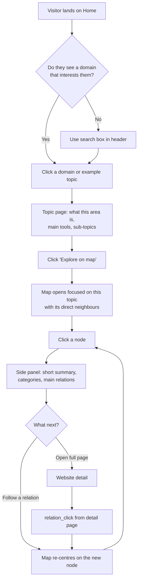
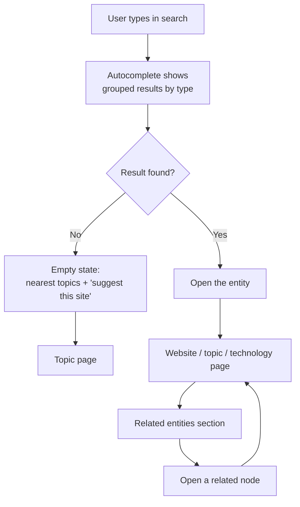
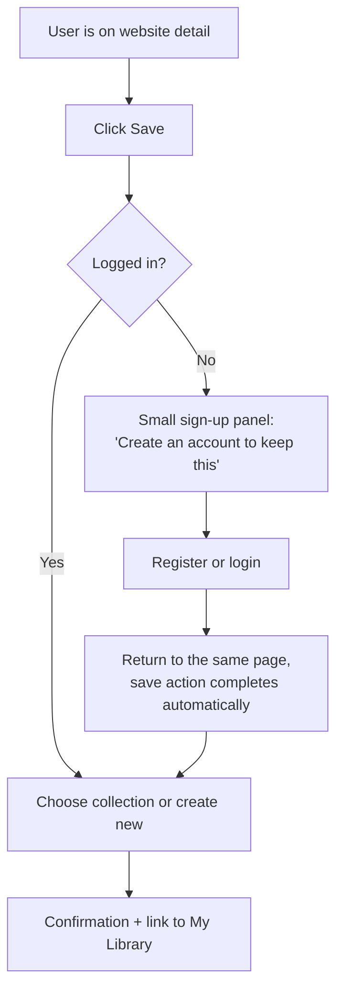
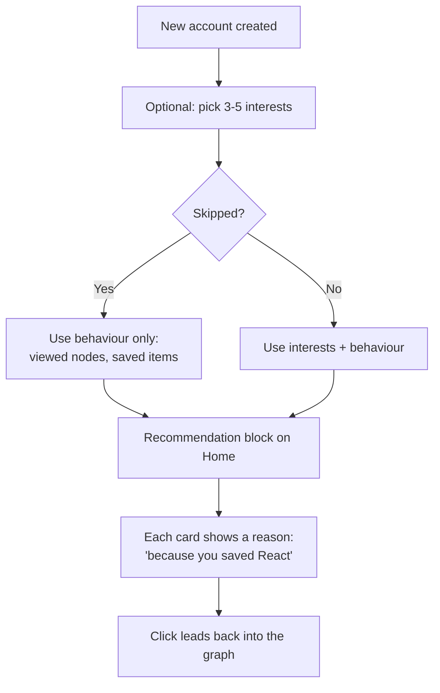
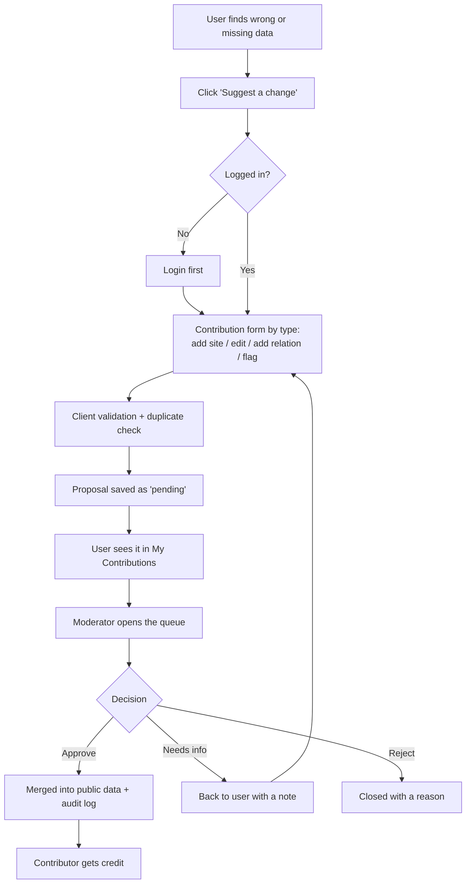
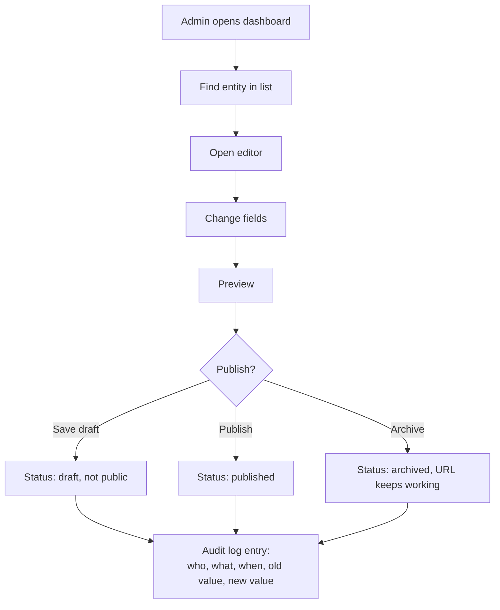

# Phase 2 — User Flows, Screens and States

**Status:** Locked · **Version:** 1.0 · **Date:** 2026-08-19
**Depends on:** [00-vision.md](00-vision.md), [01-problem-and-users.md](01-problem-and-users.md)

This document defines how a user moves through the product, screen by screen and state by state.
It is written before any UI design. Phase 3 turns these screens into entities, and Phase 6 turns
these flows into API contracts.

---

## 1. Decisions locked in Phase 2

| ID | Decision | Reason |
|---|---|---|
| F-01 | **Topic first, then map.** The home page shows the four v1 domains and example topics. The graph opens *around a chosen topic*, never as a blank full graph. | A full graph with no context creates the "maze" failure from the anti-vision. The Learner needs a starting point. |
| F-02 | **All exploring is open to anonymous users.** An account is needed only to save, personalise or contribute. | The North Star counts anonymous users too. A sign-up wall blocks the exact behaviour we measure, and it would hurt SEO. |
| F-03 | **We ask for an account only at the moment of saving.** No pop-ups, no timers, no "10 free views". | The request makes sense to the user at that moment, so it does not feel like a wall. |
| F-04 | **Every screen state is deep-linkable.** Filters, selected node and open panel live in the URL. | Users share links, and a refresh must not lose their place. |
| F-05 | **The map never loads the full graph.** It always starts from one focus node and loads neighbours step by step. | Performance and understanding both break with a huge first render. |

---

## 2. Screen inventory

`Anon` = anonymous user can open it. `Auth` = login required.

| ID | Screen | Route | Access | Phase |
|---|---|---|---|---|
| S-01 | Home (topic first) | `/` | Anon | 16 |
| S-02 | All topics | `/topics` | Anon | 16 |
| S-03 | Topic detail | `/topics/:slug` | Anon | 16 |
| S-04 | Atlas map | `/map?focus=:id` | Anon | 14 |
| S-05 | Website detail | `/websites/:slug` | Anon | 15 |
| S-06 | Technology detail | `/tech/:slug` | Anon | 15 |
| S-07 | Search results | `/search?q=` | Anon | 17 |
| S-08 | Login | `/login` | Anon | 8 |
| S-09 | Register | `/register` | Anon | 8 |
| S-10 | Email verification | `/verify-email` | Anon | 8 |
| S-11 | My library (saved items) | `/me/library` | Auth | 19 |
| S-12 | Collection detail | `/collections/:slug` | Anon if public | 19 |
| S-13 | Profile settings | `/me/settings` | Auth | 20 |
| S-14 | Public profile | `/u/:username` | Anon | 20 |
| S-15 | Interests picker | `/me/interests` | Auth | 20 |
| S-16 | Path viewer | `/paths/:slug` | Anon | 21 |
| S-17 | Contribution form | `/contribute/:type` | Auth | 23 |
| S-18 | My contributions | `/me/contributions` | Auth | 23 |
| S-19 | Admin dashboard | `/admin` | Admin | 12 |
| S-20 | Admin entity editor | `/admin/:entity/:id` | Admin | 12 |
| S-21 | Moderation queue | `/admin/moderation` | Moderator | 24 |
| S-22 | Audit log | `/admin/audit` | Admin | 12 |
| S-23 | Not found / archived | `/404`, in-page | Anon | 15 |

**MVP screens only:** S-01 to S-10, S-19, S-20, S-22, S-23. The rest arrive with their phases.

---

## 3. Core flows

### F1 — New visitor explores a topic (the main flow)

This is the flow that produces the North Star Metric. It must work perfectly before anything else.

**Rules for this flow**

- Every step must be possible without an account.
- The map opens with **one focus node plus its direct neighbours only** (F-05).
- Clicking a node opens a **side panel**, not a new page. Full page change breaks the feeling
  of exploring.
- The URL updates on every focus change, so back and share both work.
- Success for this flow = the user reaches step `L` at least twice (this is the North Star).

### F2 — Search leads into the graph

**Rule:** a search result page is never a dead end. Even with zero results we show the closest
topics, so the user can continue.

### F3 — Save into a collection (first sign-up moment)

**Rule:** after login the user must land back **exactly where they were**, and the save they
asked for must happen by itself. Losing the action is the fastest way to lose the user.

### F4 — Interests lead to recommendations

**Rule:** the interests step can always be skipped. A recommendation without a visible reason is
not allowed to ship (Phase 22).

### F5 — Community contribution reaches the public graph

**Rule:** nothing a user submits appears in the public graph before a moderator or a trusted
automatic check approves it. This is a hard rule from the vision (guardrail 3).

### F6 — Admin edit with audit trail

**Rule:** every write action creates an audit entry. No silent edits, even by an admin.

---

## 4. State inventory

Every screen must define all five states before it is called done. This table is the checklist.

| State | What it means | Global rule |
|---|---|---|
| **Loading** | Data is coming | Show the page shape (skeleton), never a blank screen or a full-page spinner |
| **Empty** | The request worked, but there is no data | Always give one next action. An empty screen with no exit is a bug |
| **Error** | Something failed | Say what failed in plain words, offer retry, never show a raw error code to the user |
| **Unauthorized** | Login or a role is missing | Explain what is needed and why; keep the original destination and return to it after login |
| **Archived / gone** | The object existed but is not active | Keep the URL alive, show the last known data, mark it clearly as archived |

### Per-screen states that need real content

| Screen | Empty state | Archived / special |
|---|---|---|
| Home | Never empty — seed data guarantees content | — |
| Topic detail | "This topic is new. Here are its parent topic and nearby topics." | Merged topic redirects to its new topic |
| Atlas map | Node has no relations yet → show it alone with "suggest a connection" | Node archived → shown greyed out, still clickable |
| Website detail | No relations yet → show category siblings instead | Dead site → red badge, last verified date, still readable |
| Search results | Zero results → nearest topics + "suggest this site" | — |
| My library | No saved items → short explanation + link to a starting topic | — |
| Collection | Empty collection → "add your first item" | Private collection seen by another user → 404, not 403 |
| Moderation queue | No pending items → "queue is clear" | — |

**Privacy rule:** a private object that the user is not allowed to see returns **404, not 403**.
A 403 tells a stranger that the object exists.

---

## 5. Rules that apply to every flow

1. **Return to origin.** Any flow that goes to login comes back to the exact page and finishes
   the action the user started.
2. **The URL is the state.** Focus node, open panel, filters and search query all live in the URL.
3. **Back always works.** Browser back must undo one step of exploring, not leave the map.
4. **No dead ends.** Every screen, in every state, offers at least one way to continue.
5. **Anonymous identity exists.** We give anonymous visitors an id in a cookie, so the North Star
   Metric can count them. This id is replaced by the user id after login.
6. **Mobile does not render the full graph.** On small screens the map becomes a focused list of
   the current node and its neighbours, with the same relation types.
7. **External links open in a new tab** with `rel="noopener noreferrer"`, and fire
   `external_link_click`.

---

## 6. Acceptance criteria (draft for the MVP flows)

| Flow | Acceptance criteria |
|---|---|
| F1 | From the home page, a visitor with no account can reach a website detail page in ≤ 3 clicks, and can then move to a connected node without a full page reload |
| F1 | Refreshing the map page restores the same focus node and open panel |
| F2 | A 1–2 word query returns the correct entity in the top 5; a zero-result search still shows at least 3 topic suggestions |
| F3 | After login from a save action, the user returns to the same page and the item is saved without clicking Save again |
| F6 | Every admin create, update, publish and archive writes one audit entry with old and new values |
| All | Every MVP screen has a defined loading, empty, error, unauthorized and archived state |

---

## 7. Open questions passed to Phase 3

| # | Question |
|---|---|
| Q4 | Is `Product` a separate entity from `Website`? The flows above treat them as one. |
| Q8 | Does a technology get a full detail page in the MVP, or only a filtered list? S-06 assumes a page. |
| Q9 | What exactly is the URL rule for topics with the same name in different domains? |

---

## 8. Phase 2 exit criteria

- [x] All six core flows drawn with start, middle steps and exit point
- [x] Screen inventory written, with route and access level
- [x] MVP screens separated from later screens
- [x] Five states defined for every screen, with real empty-state content
- [x] Cross-cutting rules written (return to origin, URL as state, no dead ends)
- [x] Draft acceptance criteria for the MVP flows
- [x] First-visit entry point decided (F-01) and anonymous access decided (F-02)

**Phase 2 is closed. Next: Phase 3 — Information architecture (entities, relation dictionary, URL rules).**

---

## Changelog

| Version | Date | Change |
|---|---|---|
| 1.0 | 2026-08-19 | First flow set. Topic-first entry (F-01) and open anonymous exploring (F-02) locked. |
