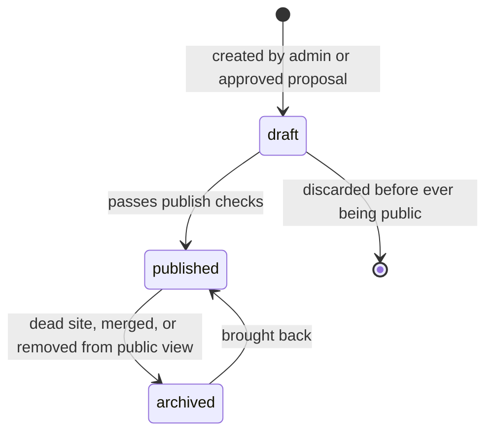

# Phase 3 — Information Architecture

**Status:** Locked · **Version:** 1.0 · **Date:** 2026-08-19
**Depends on:** [00-vision.md](00-vision.md), [01-problem-and-users.md](01-problem-and-users.md), [02-user-flows.md](02-user-flows.md)

This document fixes the words we use, the objects we store, and the connections between them.
Phase 6 turns this into typed interfaces and API contracts. Phase 7 turns it into database tables.
Nothing here describes code yet — this is the shared language.

---

## 1. Decisions locked in Phase 3

| ID | Decision | Reason |
|---|---|---|
| I-01 | **One `Website` entity with a `kind` field.** No separate `Product` table in v1. | In our four v1 domains, almost every object is one product with one main site. Two tables would double the admin work and force every relation to choose a side. |
| I-02 | **`Organization` is a text field in v1**, not an entity. | Nobody explores by company yet. We add the entity when the question "show all products by this company" actually appears. |
| I-03 | **Technology gets a light detail page in the MVP.** | Technology is a node type on the map. If a user can click it, it must lead somewhere. Answers Q8. |
| I-04 | **Slugs are unique per entity type and never reused.** Old slugs become permanent redirects. | Shared links must keep working forever. A reused slug would send an old link to the wrong object. |
| I-05 | **Undirected relations are stored once**, with the smaller id as `source_id`. | Prevents the same edge being saved twice in opposite directions. |
| I-06 | **Nothing is ever hard deleted from public data.** Objects move to `archived`, and their URL keeps working. | Dead sites are useful information, not garbage. This also protects incoming links. |

---

## 2. Domain glossary

One meaning per word. If a document, a variable name or a UI label uses these words differently,
that is a bug.

| Term | Meaning |
|---|---|
| **Node** | Any object that can appear on the map and be clicked: a Website, a Topic, or a Technology. |
| **Edge / Relation** | A stored, typed connection between two nodes. It always has a type, a confidence and a provenance. |
| **Website** | One thing in the real world that lives at one main domain: a product, a tool, a docs site, a community, or a learning resource. |
| **Kind** | What a Website is: `product`, `tool`, `service`, `docs`, `community`, `learning`, `reference`. |
| **Topic** | A subject a user can explore, such as "vector databases". Topics form a tree and are the entry point of the product. |
| **Category** | A fixed, flat-ish classification used for filtering, such as "Databases". Editorial only, never user-created. |
| **Technology** | A concrete technical thing a website is built with or offers, such as "PostgreSQL" or "React". |
| **Domain (v1 domain)** | One of the four seed areas: AI/ML tooling, developer tools, cloud & infrastructure, data & databases. This is a top-level Category, not a separate entity. |
| **Canonical URL** | The one normalised address of a Website. Used to detect duplicates. |
| **Slug** | The short text id used in our URLs, for example `next-js`. |
| **Provenance** | Where a fact came from: `editorial`, `crawler`, `detector`, `ai`, `community`. |
| **Confidence** | How sure we are about a fact, from 0.0 to 1.0. |
| **Status** | The lifecycle state of an object: `draft`, `published`, `archived`. |
| **Path** | An ordered list of steps that guides a user through a subject. |
| **Collection** | A user's own group of saved items. |
| **Proposal / Contribution** | A change suggested by a user, which is not public until approved. |

### Words we do not use

| Do not say | Say instead | Why |
|---|---|---|
| "Link" for a relation | Relation, or edge | "Link" means an HTML link in the UI code |
| "Tag" | Topic or Category | Tags suggest free, unmanaged text; ours are managed |
| "Listing", "directory entry" | Website | These words pull us back to the directory failure |
| "Article" | Resource | We do not publish articles |

---

## 3. Entity matrix

**Node types** — these appear on the map and have their own pages.

| Entity | Purpose | In v1? | Built in phase |
|---|---|---|---|
| Website | The main object of the Atlas | Yes | 9 |
| Topic | Exploration entry point, tree structure | Yes | 10 |
| Technology | What a website is built with or provides | Yes | 10 |

**Supporting entities** — real objects, but not nodes on the map.

| Entity | Purpose | In v1? | Built in phase |
|---|---|---|---|
| Category | Filtering and top-level structure | Yes | 10 |
| Relation | A typed edge between two nodes | Yes | 11 |
| User | Account and role | Yes | 8 |
| Profile | Public part of a user | Yes | 20 |
| AuditLog | Who changed what and when | Yes | 12 |
| Collection | A user's saved group | Later | 19 |
| Bookmark | A single saved item | Later | 19 |
| Path / PathStep | Guided exploration route | Later | 21 |
| Resource | An external article, video or doc we point to | Later | 21 |
| Contribution | A proposed change | Later | 23 |
| CrawlJob / CrawlResult | Crawler work and its output | Later | 26 |
| TechnologyDetection | Detector result with evidence | Later | 27 |
| ChangeEvent | A recorded change over time | Later | 29 |
| Organization | The company behind a product | **No** (text field) | Not scheduled |
| Product | Separate from Website | **No** (merged into Website) | Not scheduled |

### Website — the core fields

| Field | Notes |
|---|---|
| `id` | Internal id, never shown in URLs |
| `slug` | Our URL id, unique, never reused |
| `name` | Display name, for example "Next.js" |
| `kind` | product / tool / service / docs / community / learning / reference |
| `canonical_url` | The normalised main address |
| `primary_domain` | Extracted from the canonical URL, unique among published websites |
| `short_description` | One sentence, max 160 characters, shown in cards and search |
| `long_description` | A few paragraphs, shown on the detail page |
| `organization_name` | Plain text in v1 (I-02) |
| `logo`, `screenshot` | Object storage references |
| `status` | draft / published / archived |
| `launch_date` | Optional, may be unknown |
| `last_verified_at` | Shown in the UI; required before publishing |
| `quality_score` | Filled from Phase 25; null before that |

**Rule:** a Website cannot be published without a `short_description`, one Category, and at least
two relations. This comes straight from data-quality target D1.

### Topic vs Category — the difference

People confuse these, so the rule is strict.

| | Topic | Category |
|---|---|---|
| Purpose | Something a user wants to *explore* | A drawer used to *filter* |
| Example | "Retrieval augmented generation" | "AI & ML tooling" |
| Structure | Deep tree, can grow fast | Shallow, changes rarely |
| Who creates it | Editors, later community proposals | Editors only |
| Count in v1 | ~60–100 | ~20, with the 4 v1 domains at the top |
| Appears on map | Yes, as a node | No |

Simple test: if it can be the title of a learning route, it is a **Topic**. If it is a drawer you
put things in, it is a **Category**.

---

## 4. Relation dictionary

This is the heart of the product. Every relation type is listed here with its direction and the
node types it is allowed to connect. A relation that is not in this table cannot be created.

| Type | Direction | From → To | Meaning | Example |
|---|---|---|---|---|
| `belongs_to` | Directed | Website → Topic | The website is part of this subject | Pinecone → Vector databases |
| `built_with` | Directed | Website → Technology | The site or product is built using this | Vercel → React |
| `provides` | Directed | Website → Technology | The product offers this technology as its service | Supabase → PostgreSQL |
| `alternative_to` | **Undirected** | Website ↔ Website | Same job, a user would pick one of them | Vercel ↔ Netlify |
| `competitor_of` | **Undirected** | Website ↔ Website | Same market, business rivals | Snowflake ↔ Databricks |
| `integrates_with` | Directed | Website → Website | A works together with B, usually A builds the connection | Stripe → Shopify |
| `part_of` | Directed | Website → Website, Technology → Technology | Belongs to a bigger family or ecosystem | Next.js → React ecosystem |
| `related_to` | **Undirected** | any ↔ any | Meaningful closeness with no better type | React ↔ TypeScript |
| `replaced_by` | Directed | Website → Website | The first one is dead or renamed | OldTool → NewTool |
| `inspired_by` | Directed | Website → Website | Clear historical influence | Deno → Node.js |
| `recommends` | Directed | Path → Website/Topic | A step inside an exploration route | Path → Pinecone |

**`alternative_to` vs `competitor_of`:** alternative is about the *user's* choice, competitor is
about the *market*. Two open-source projects can be alternatives without being competitors.

### Relation fields

| Field | Notes |
|---|---|
| `source_id`, `target_id` | For undirected types, the smaller id is always the source (I-05) |
| `type` | From the table above only |
| `weight` | 0.0–1.0, how strong the connection is; controls map layout and ordering |
| `confidence` | 0.0–1.0, how sure we are that it is true |
| `provenance` | editorial / crawler / detector / ai / community |
| `status` | draft / published / archived |
| `note` | Optional short text shown on hover, for example "used for their dashboard" |

### Relation rules

1. **No duplicates.** One pair plus one type can exist only once. For undirected types this is
   enforced by the smaller-id rule.
2. **No self relations.** A node cannot relate to itself.
3. **`part_of` must not create a cycle.** A is part of B, B is part of A is invalid.
   The same check applies to Topic parent-child and Category parent-child.
4. **Only listed node type pairs are allowed.** A Topic cannot be `built_with` a Technology.
5. **Every published relation needs `provenance` and `confidence`.** No exceptions (target D2).
6. **`replaced_by` changes behaviour**, not just data: the old website page shows a clear notice
   and a link to the new one.
7. **Inverse relations are not stored.** If the UI needs "who integrates with me", the query
   reads the same table in the other direction.

---

## 5. URL and slug policy

### Our URLs

| Object | URL |
|---|---|
| Website | `/websites/:slug` |
| Topic | `/topics/:slug` |
| Technology | `/tech/:slug` |
| Category | `/categories/:slug` |
| Map | `/map?focus=:type::slug` |
| Search | `/search?q=` |
| Collection | `/collections/:slug` |
| Path | `/paths/:slug` |
| Public profile | `/u/:username` |

### Slug rules

1. Lower case, only `a–z`, `0–9` and `-`. Maximum 60 characters.
2. Made from the name. Non-English letters are converted (`ö` → `o`, `ş` → `s`).
3. **Unique per entity type.** A Topic and a Website may both use `react`, because their URL
   prefixes differ.
4. **Collisions get a qualifier, not a number.** Two topics named "Security" become
   `security-cloud` and `security-data`, never `security-2`. This answers Q9.
5. **Slugs are never reused.** When a slug changes, the old one is stored in an alias table and
   redirects with HTTP 301 forever.
6. Reserved words that can never be a slug: `admin`, `api`, `me`, `auth`, `login`, `register`,
   `search`, `map`, `new`, `edit`, `settings`, `static`, `assets`, `v1`.

### Canonical URL rules (for the real external site)

Normalising is what stops duplicate websites in the database.

1. Force `https`.
2. Lower case the host. Remove `www.`.
3. Remove tracking parameters (`utm_*`, `ref`, `fbclid`) and the fragment (`#...`).
4. Remove the trailing slash, unless the path is only `/`.
5. Keep the path if it is meaningful; drop it if it is just a language or home path.
6. **One website = one primary domain.** A subdomain becomes its own Website only if it is an
   independent product (`vercel.com` and `nextjs.org` are separate; `vercel.com/docs` is not).

---

## 6. Lifecycle, archive and delete

### Status flow

### Publish checks (a website cannot become `published` without these)

- `short_description` is filled
- at least one Category
- at least two published relations
- `last_verified_at` is set
- `canonical_url` is normalised and unique among published websites

### Archive rules

- The page stays online and keeps its URL.
- A clear badge says why: *dead site*, *merged*, or *removed*.
- Archived nodes still appear on the map, but greyed out and pushed to the edge.
- Archived items never appear in search results by default.

### Delete rules

- **Public content is never hard deleted.** Only spam and illegal content are removed
  completely, and that action is written to the audit log.
- **User data is different.** When a user deletes their account, their personal data is really
  deleted, but their approved contributions stay in the public graph as anonymous.
  This split will be written properly in Phase 8 and Phase 36.

### Merge rules (two records turn out to be the same thing)

1. Choose the surviving record.
2. Move all relations to it, skipping ones that would become duplicates.
3. The old slug becomes a redirect to the survivor.
4. The old record becomes `archived` with reason `merged`.
5. One audit entry records both ids.

---

## 7. Identifiers

- Every entity has an internal `id`. The exact format (UUID or ULID) is a **Phase 6 decision**,
  because it depends on the database and ORM choice.
- Internal ids are never shown in public URLs. Public URLs use slugs.
- The map may use ids in query parameters, because those links are temporary, not shared content.

---

## 8. Open questions passed forward

| # | Question | Answered in |
|---|---|---|
| Q10 | UUID or ULID for internal ids | Phase 6 ✅ (UUIDv7) |
| Q11 | Do Topics need their own `kind` field (concept, technique, use case)? | Phase 10, after seeding |
| Q12 | Should `weight` be set by hand or calculated from signals? | Phase 25 |
| Q13 | How many Categories are too many before filtering gets confusing? | Phase 18 |

---

## 9. Phase 3 exit criteria

- [x] Core entity list finalised, and v1 entities separated from later ones
- [x] Every term defined once, with a "words we do not use" list
- [x] Website / Topic / Category / Technology differences written with a simple test
- [x] Relation dictionary complete, with direction and allowed node type pairs
- [x] Relation rules written (no duplicates, no self relations, no cycles, provenance required)
- [x] Slug and canonical URL policy written, including collisions and redirects
- [x] Archive, delete and merge rules written
- [x] Q4, Q8 and Q9 answered

**Phase 3 is closed. Part I is complete. Next: Phase 4 — Architecture decisions (the technical stack).**

---

## Changelog

| Version | Date | Change |
|---|---|---|
| 1.0 | 2026-08-19 | First information architecture. One Website entity (I-01), Organization as text (I-02), relation dictionary fixed. |
