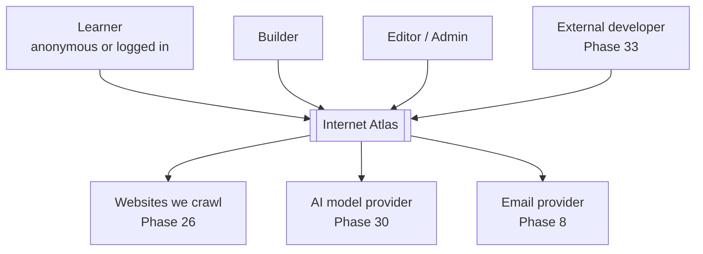
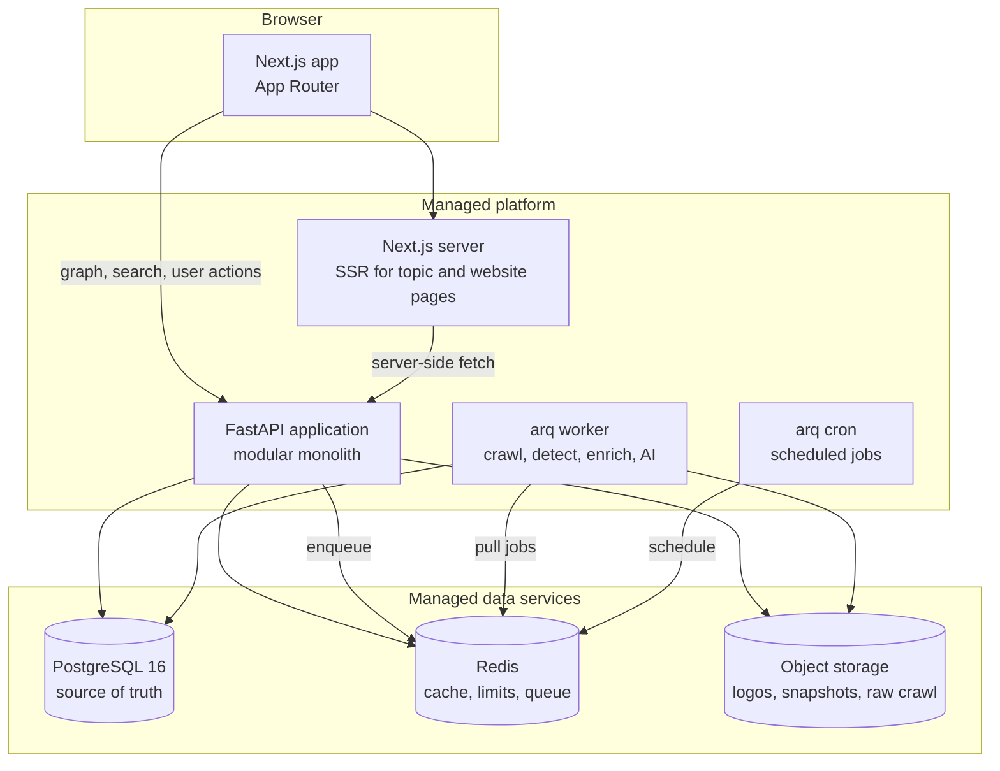
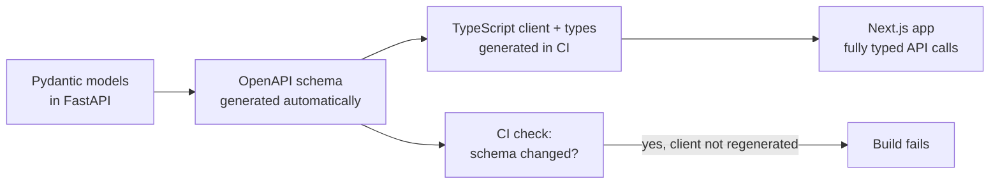

# Phase 4 — Architecture Decisions

**Status:** Locked · **Version:** 1.0 · **Date:** 2026-08-19
**Depends on:** Part I (Phases 0–3)
**Detailed decisions:** [`docs/adr/`](../adr/)

This document chooses the system we will build. The goal is the smallest architecture that can
still reach Phase 39 without a rewrite. Every choice has a written reason and at least one
rejected option, so a future developer can see *why*, not only *what*.

---

## 1. The stack in one table

| Area | Choice | ADR |
|---|---|---|
| Shape | Modular monolith, two deployable apps (API, worker) | [ADR-001](../adr/ADR-001-modular-monolith.md) |
| Backend | Python 3.12 + FastAPI + Pydantic v2 | [ADR-002](../adr/ADR-002-python-fastapi.md) |
| Frontend | Next.js (App Router) + TypeScript + React | [ADR-003](../adr/ADR-003-nextjs.md) |
| Database | PostgreSQL 16, single source of truth | [ADR-004](../adr/ADR-004-postgresql.md) |
| Graph | Relation tables + recursive SQL, no graph database | [ADR-005](../adr/ADR-005-relations-not-graphdb.md) |
| ORM / migrations | SQLAlchemy 2.0 (async) + Alembic | [ADR-006](../adr/ADR-006-sqlalchemy-alembic.md) |
| Cache / limits | Redis | [ADR-007](../adr/ADR-007-redis.md) |
| Background jobs | arq (async, Redis-based) behind our own interface | [ADR-008](../adr/ADR-008-background-jobs.md) |
| Search | PostgreSQL full-text search first | [ADR-009](../adr/ADR-009-postgres-fts.md) |
| File storage | S3-compatible object storage | [ADR-010](../adr/ADR-010-object-storage.md) |
| Type sharing | OpenAPI → generated TypeScript client | [ADR-011](../adr/ADR-011-openapi-typed-client.md) |
| Auth transport | httpOnly session cookie, opaque token | [ADR-012](../adr/ADR-012-session-cookies.md) |
| Hosting | Managed platforms, portable by design | [ADR-013](../adr/ADR-013-managed-hosting.md) |
| Repository | One monorepo holding both languages | [ADR-014](../adr/ADR-014-monorepo.md) |

---

## 2. Context diagram (who talks to the system)



Only three outside systems, and none of them exists before Phase 8. Everything before that runs
with the database alone.

## 3. Container diagram (what we actually deploy)



**Three deployable units:** the Next.js app, the FastAPI app, and the worker.
The worker runs the same codebase as the API — same models, same services — but a different entry
point. This is the "modular monolith" idea in practice: one code base, more than one process.

---

## 4. Backend module boundaries

The API is one application, but the inside is split by domain. These folders are the walls that
keep a monolith from turning into a mess.

```
apps/api/src/atlas/
├─ core/            # config, logging, errors, security helpers
├─ db/              # engine, session, base model, migrations link
├─ modules/
│  ├─ auth/         # users, sessions, roles, permissions
│  ├─ catalog/      # websites, categories, technologies
│  ├─ taxonomy/     # topics, trees, merges
│  ├─ graph/        # relations, neighbours, traversal
│  ├─ search/       # query building, ranking
│  ├─ library/      # bookmarks, collections (Phase 19)
│  ├─ paths/        # exploration paths (Phase 21)
│  ├─ contrib/      # proposals, moderation (Phase 23-24)
│  ├─ quality/      # scoring (Phase 25)
│  ├─ ingest/       # crawler, detectors, enrichment (Phase 26-30)
│  └─ admin/        # admin-only endpoints
├─ jobs/            # queue interface + job definitions
└─ main.py
```

**Module rules (checked in code review, later by a lint rule):**

1. A module may import from `core`, `db`, and its own folder.
2. A module may **not** import another module's internals. It calls that module's service layer.
3. `graph` is the only module allowed to write to the relations table.
4. `ingest` never writes to public tables directly. It writes proposals, which get approved.
5. No module imports from `admin`.

Rule 4 is the technical version of the vision rule "AI never publishes by itself".

---

## 5. Layer responsibilities

| Layer | Does | Must not do |
|---|---|---|
| Next.js pages/components | Rendering, client state, accessibility | Direct database access, secrets |
| FastAPI routers | Auth check, validation, shaping the response | Business rules |
| Services | Business rules, scoring, relation logic | Knowing about HTTP |
| Repositories | Database queries | UI conditions |
| Worker jobs | Long, slow work | Anything a user waits for |
| Infrastructure | Queue, cache, storage, deploy | Domain decisions |

The important line: **a user request never waits for crawling, detection or AI.** Those always go
to the worker.

---

## 6. How the two languages stay in sync

This is the main cost of choosing Python for the API and TypeScript for the web app. We pay it
once, with automation, instead of every day by hand.



**Rules:**

- The Python models are the only source of truth. TypeScript types are never written by hand.
- The generated client lives in `packages/api-client` and is committed, so builds are repeatable.
- CI fails if the committed client does not match the current OpenAPI schema. This is our
  "schema drift" alarm from Phase 6.

---

## 7. Graph access strategy

We do not use a graph database (ADR-005). Instead:

- **Phase 11:** a `relations` table with indexes on `source_id` and `target_id`.
- **Neighbours query:** one indexed select, always with a `LIMIT`.
- **Depth 2–3:** a recursive CTE (`WITH RECURSIVE`) with a hard node limit.
- **Hard limits from day one:** max depth 3, max 300 nodes per response.
- **Cache:** neighbour results cached in Redis, keyed by node id + depth + filters.

**The trigger to reconsider:** if a normal exploration query needs depth 4+, or the recursive CTE
p95 goes over 300 ms with real data, we re-open ADR-005. Not before. Writing the trigger down is
how we avoid both mistakes: switching too early, and refusing to switch when it is time.

---

## 8. Environment matrix

| | Local | Preview | Production |
|---|---|---|---|
| Purpose | Daily development | One environment per pull request | Real users |
| Web | `next dev` | Auto-deployed per PR | Managed platform |
| API + worker | Docker Compose | Auto-deployed per PR | Managed platform |
| Database | Postgres in Docker | Branch database (throwaway copy) | Managed Postgres, backups on |
| Redis | Redis in Docker | Managed Redis, small | Managed Redis |
| Storage | Local folder or MinIO | Test bucket | Real bucket |
| Data | Seed fixtures | Seed fixtures | Real data |
| Emails | Written to console | Catch-all inbox | Real provider |
| Crawler | Off by default | Off | On, with rate limits |
| AI calls | Fake responses by default | Fake responses | Real, with cost limits |
| Secrets | `.env` file, never committed | Platform secret store | Platform secret store |
| Who can reach it | You | Anyone with the link | Public |

**Rules:**

- Local development must work with **one command** and needs no cloud account (Phase 5 exit rule).
- The crawler and AI calls are **off by default everywhere except production**. This prevents an
  accidental thousand-page crawl from a laptop, and surprise AI bills.
- Preview environments never use the production database.

---

## 9. What we are deliberately not using yet

Naming these stops the "we should add X" conversation from repeating.

| Not used | When we would reconsider |
|---|---|
| Graph database (Neo4j etc.) | Depth 4+ queries needed, or CTE p95 > 300 ms |
| Dedicated search engine (Elasticsearch, Typesense, Meilisearch) | Typo tolerance becomes a real complaint, or FTS p95 > 200 ms |
| Kubernetes | Never, at this size |
| Microservices | Never for v1; module boundaries first |
| GraphQL | If the public API (Phase 33) gets many different client shapes |
| Kafka or a big message broker | If Redis queue depth becomes a real bottleneck |
| A separate analytics database | If event volume slows down the main database |

Every line here is a decision to **not** spend time, not a gap in the plan.

---

## 10. Performance targets set now (checked in Phase 37)

Writing them at architecture time makes them a design input, not a repair job later.

| Path | Target (p95) |
|---|---|
| Topic page, server rendered | < 800 ms |
| Website detail, server rendered | < 800 ms |
| `GET /graph/neighbors/:id` | < 300 ms |
| Search autocomplete | < 150 ms |
| Search results | < 400 ms |
| Any user-facing write | < 500 ms |

---

## 11. Open questions passed forward

| # | Question | Answered in |
|---|---|---|
| Q10 | UUID or ULID for ids | Phase 6 |
| Q15 | Which managed platform exactly (Vercel/Railway/Render/Fly, Neon/Supabase) | Phase 5, when we deploy the first version |
| Q16 | Do we need a read replica? | Phase 37 |
| Q17 | Rate limit numbers per endpoint | Phase 36 |

---

## 12. Phase 4 exit criteria

- [x] Monolith vs microservices decided and written down (ADR-001)
- [x] Frontend framework and rendering strategy decided (ADR-003)
- [x] Database, cache, queue, storage and search choices each have a reason and a rejected option
- [x] Graph access strategy decided, with a written trigger for changing it
- [x] Module boundaries defined, with import rules
- [x] Context and container diagrams drawn
- [x] Environment matrix written
- [x] Cross-language type safety solved (ADR-011)
- [x] Performance targets set before building

**Phase 4 is closed. Next: Phase 5 — Repository and development standards (the first real code).**

---

## Changelog

| Version | Date | Change |
|---|---|---|
| 1.0 | 2026-08-19 | Stack chosen: FastAPI + Next.js + PostgreSQL + Redis on managed hosting. ADR-001 to ADR-014 written. |
